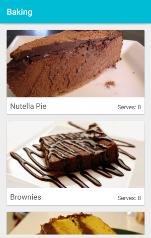
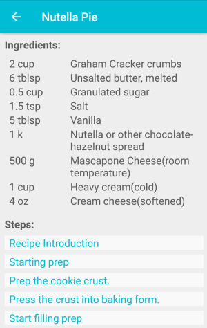
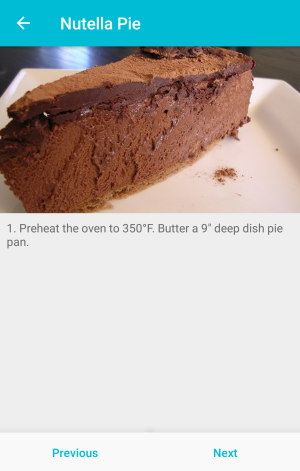

# Baking

Baking is an Android app that allows users to view baking recipes.

This was created as part of the Android Developer Nanodegree course.

## Project Details

The task for this project was to create an app that will allow a user to select a recipe and see video-guided steps for how to complete it.

- Used Exoplayer to display videos.
- Added a widget using RemoteViewsService and AppWidgetProvider.
- To allow the user to select which list of ingredients to display in the widget, I implemented a widget configuration Activity.
- With Fragments and layouts for different screen sizes and orientations, I created a responsive design that works on phones and tablets.
- Created Espresso tests to verify the UI works as intended.
- Added [Butter Knife](https://github.com/JakeWharton/butterknife) for the easy binding of views.

## Example Usage

The main screen of the Baking app displays each recipe in a CardView.

A list of ingredients and steps are shown in the details for each recipe.

The details screen of each step displays the video with a description below.

## License

This project is licensed under the MIT License - see the [LICENSE.md](LICENSE.md) file for details.

